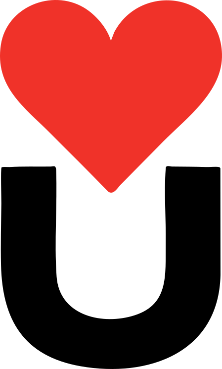

# ❤️U Festival — Progressive Web App

<p align="center">
  
</p>

<p align="center">
  <strong>De officiële bezoekersapp voor het ❤️U Festival in Utrecht</strong><br/>
  <em>15 & 16 augustus 2026 — Grasweide Strijkviertel, Utrecht</em>
</p>

<p align="center">
  
  
  
  
</p>

---

## 📋 Inhoudsopgave

- [Over het project](#-over-het-project)
- [Over ❤️U Festival](#-over-u-festival)
- [Features](#-features)
- [Tech Stack](#-tech-stack)
- [Architectuur](#-architectuur)
- [Installatie &amp; Ontwikkeling](#-installatie--ontwikkeling)
- [Projectstructuur](#-projectstructuur)
- [PWA-functionaliteit](#-pwa-functionaliteit)
- [Data &amp; Content](#-data--content)
- [Licentie](#-licentie)

---

## 🎯 Over het project

Deze Progressive Web App (PWA) is ontwikkeld als mobiele bezoekersapplicatie voor het ❤️U Festival. De app biedt bezoekers een complete digitale festivalervaring: van het raadplegen van het programma en het navigeren over het terrein tot het delen van hun beleving via een live social feed.

De applicatie is gebouwd als een **Single Page Application (SPA)** met vanilla JavaScript — zonder zware frameworks — om maximale snelheid en offline beschikbaarheid te garanderen. Bezoekers installeren de app direct via een QR-code op het festival, zonder tussenkomst van een app store.

---

## 🎵 Over ❤️U Festival

**❤️U** is een nieuw tweedaags muziekfestival voor alle (nieuwe) studenten in de regio Utrecht. Het festival is een aanvulling op de *Utrechtse Introductie Tijd (UIT)* en wordt georganiseerd op de **Grasweide Strijkviertel** in Utrecht.

|                        | Details                                                                                                                                    |
| ---------------------- | ------------------------------------------------------------------------------------------------------------------------------------------ |
| **📅 Datum**     | Zaterdag 15 & zondag 16 augustus 2026                                                                                                      |
| **📍 Locatie**   | Grasweide Strijkviertel, Utrecht                                                                                                           |
| **🎫 Toegang**   | Tickets (op naam) via onderwijsinstellingen                                                                                                |
| **🎤 Podia**     | Proton Stage · The Lake · The Club · Hangar                                                                                             |
| **🎶 Artiesten** | Armin van Buuren, Martin Garrix, Kensington, De Staat, Froukje, Within Temptation, Dotan, Eefje de Visser, Chef'Special, Spinvis, Navarone |

Het festival wordt gesponsord door de Gemeente Utrecht en diverse Utrechtse onderwijsinstellingen (HU, UU, ROC's, GLU).

---

## ✨ Features

### Kernfunctionaliteit

| Feature                | Beschrijving                                                                                                    |
| ---------------------- | --------------------------------------------------------------------------------------------------------------- |
| **🏠 Home**      | Landingspagina met live social feed, shake-to-discover en nieuwsmeldingen                                       |
| **ℹ️ Info**    | Festival-informatie in een interactieve accordion-layout (bereikbaarheid, regels, eten & drinken, duurzaamheid) |
| **📅 Programma** | Interactief blokkenschema met dag-filter, favorietenfilter en artiest-detailweergave met video                  |
| **🗺️ Kaart**   | Interactieve plattegrond met GPS-localisatie, custom SVG-markers en realtime podium-informatie                  |

### Extra Features

| Feature                        | Beschrijving                                                                             |
| ------------------------------ | ---------------------------------------------------------------------------------------- |
| **📸 Live Social Feed**  | Deel tekst, foto's (via devicecamera) en voice notes met andere bezoekers                |
| **📱 Shake to Discover** | Schud je telefoon om een willekeurige artiest of locatie te ontdekken (DeviceMotion API) |

### Overige Features

- **🌙 Dark Mode** — Automatisch licht/donker thema met handmatige toggle
- **🌐 Tweetalig** — Volledige ondersteuning voor Nederlands en Engels (i18n)
- **❤️ Favorieten** — Markeer artiesten als favoriet met persistente opslag
- **🔔 Meldingen** — Automatische herinneringen wanneer een favoriet artiest bijna begint
- **📲 Installeerbaar** — Volwaardige PWA met offline-ondersteuning en installatie via QR-code
- **🎬 Artiestdetails** — Per artiest: foto, beschrijving, genre en embedded YouTube-video
- **📍 GPS-tracking** — Realtime locatie op de festivalkaart met pulserende blauwe marker

---

## 🛠️ Tech Stack

| Categorie            | Technologie                                                       |
| -------------------- | ----------------------------------------------------------------- |
| **Build Tool** | [Vite 8](https://vitejs.dev/)                                        |
| **Taal**       | Vanilla JavaScript (ES Modules)                                   |
| **Styling**    | CSS3 met Custom Properties (design tokens)                        |
| **Typografie** | [Sansation](assets/Content/Sansation/) (custom font family)          |
| **PWA**        | [vite-plugin-pwa](https://vite-pwa-org.netlify.app/) + Workbox       |
| **Kaart**      | [Leaflet.js](https://leafletjs.com/) (via CDN)                       |
| **Animaties**  | [anime.js](https://animejs.com/) v3                                  |
| **Touch**      | [Hammer.js](https://hammerjs.github.io/) (swipe & gesture detection) |
| **Iconen**     | Custom SVG icon system                                            |

---

## 🏗️ Architectuur

De applicatie volgt een **modulaire component-gebaseerde architectuur** zonder framework-overhead:

```
┌─────────────────────────────────────────────┐
│                   App (app.js)              │
│  Bootstraps managers, components & router   │
├──────────┬──────────┬──────────┬────────────┤
│  Theme   │ Language │Favorites │Notification│
│  Manager │ Manager  │ Manager  │  Manager   │
├──────────┴──────────┴──────────┴────────────┤
│              Router (hash-based SPA)        │
├──────────┬──────────┬──────────┬────────────┤
│   Home   │   Info   │ Schedule │    Map     │
│   Page   │   Page   │   Page   │    Page    │
├──────────┴──────────┴──────────┴────────────┤
│          UI Components Layer                │
│   Header · Navbar · Popup · Icons           │
├─────────────────────────────────────────────┤
│          Data Layer (JSON)                  │
│  acts · schedule · stages · info · news     │
└─────────────────────────────────────────────┘
```

### Design Patterns

- **Manager Pattern** — Singleton managers voor cross-cutting concerns (theme, taal, favorieten, notificaties)
- **Hash Router** — Client-side routing via `window.location.hash` met show/hide page containers
- **Event-driven** — Custom DOM events (`navchange`, `languagechanged`) voor losse koppeling tussen componenten
- **Data-attribute i18n** — Alle vertaalbare tekst via `data-i18n` attributen voor automatische taalupdates

---

## 🚀 Installatie & Ontwikkeling

### Vereisten

- [Node.js](https://nodejs.org/) ≥ 18
- [npm](https://www.npmjs.com/) ≥ 9

### Installatie

```bash
# Clone de repository
git clone https://github.com/Abud-Alr/U-Festival.git
cd U-Festival

# Installeer dependencies
npm install
```

### Ontwikkelen (dev server)

```bash
npm run dev
```

De app is beschikbaar op `http://localhost:5173`. De dev server ondersteunt Hot Module Replacement (HMR).

### Productie build

```bash
npm run build
```

De geoptimaliseerde output wordt gegenereerd in de `dist/` map, inclusief service worker en PWA-assets.

### Preview productie build

```bash
npm run preview
```

---

## 📁 Projectstructuur

```
U-Festival/
├── assets/                    # Statische bronbestanden
│   ├── Acts/                  # Artiestenfoto's (PNG + SVG)
│   ├── Content/               # Logo's, podiumfoto's, fonts
│   │   └── Sansation/         # Sansation font family (TTF)
│   ├── FloorPlan/             # Festivalkaart SVG + marker-iconen
│   └── Schema/                # Blokkenschema bronbestand (PDF)
│
├── Docs/                      # Projectdocumentatie
│   ├── MAD_Antwoorden.docx    # Mobile App Development antwoorden
│   ├── PWA_Onderzoek.docx     # PWA onderzoeksrapport
│   └── Tech_Stack.docx        # Technische stack verantwoording
│
├── Examples/                  # Wireframes & mockups (referentie)
│
├── public/                    # Statische public bestanden
│   ├── manifest.json          # PWA Web App Manifest
│   ├── favicon.svg            # Favicon
│   ├── icon-192.png           # PWA icoon 192×192
│   ├── icon-512.png           # PWA icoon 512×512
│   ├── icons.svg              # SVG icon sprite
│   └── qr-landing.html       # QR-code installatie landingspagina
│
├── scripts/                   # Build & utility scripts
│   ├── copy-assets.mjs        # Post-build asset kopie
│   ├── generate-assets.mjs    # Asset generatie
│   └── inspect_svg_*.cjs      # SVG coördinaat inspectie tools
│
├── src/
│   ├── css/
│   │   ├── fonts.css          # @font-face declaraties
│   │   ├── variables.css      # CSS custom properties & theming
│   │   ├── base.css           # CSS reset & basis-styling
│   │   ├── components.css     # Herbruikbare component-stijlen
│   │   └── pages.css          # Pagina-specifieke stijlen
│   │
│   ├── data/
│   │   ├── acts.json          # Artiesten (tweetalig)
│   │   ├── schedule.json      # Blokkenschema
│   │   ├── stages.json        # Podia & coördinaten
│   │   ├── info.json          # Festivalinfo (accordion data)
│   │   ├── news.json          # Nieuwsberichten
│   │   ├── mapMarkers.json    # Kaartmarker posities
│   │   └── translations.json  # UI vertalingen (NL/EN)
│   │
│   ├── js/
│   │   ├── app.js             # Hoofd App class
│   │   ├── router.js          # Hash-based SPA router
│   │   ├── theme.js           # Dark/light theme manager
│   │   ├── language.js        # i18n taalmanager
│   │   ├── favorites.js       # Favorieten (localStorage)
│   │   ├── notifications.js   # Push-notificatie simulatie
│   │   ├── animations.js      # anime.js animatie-helpers
│   │   │
│   │   ├── components/
│   │   │   ├── header.js      # App header (logo, toggles)
│   │   │   ├── navbar.js      # Bottom navigation bar
│   │   │   ├── popup.js       # Modal bottom-sheet popup
│   │   │   └── icons.js       # SVG icon module
│   │   │
│   │   └── pages/
│   │       ├── home.js        # Home (feed, shake, nieuws)
│   │       ├── info.js        # Info (accordion)
│   │       ├── schedule.js    # Programma (tijdlijn)
│   │       └── map.js         # Kaart (Leaflet + GPS)
│   │
│   ├── main.js                # Vite entry point
│   └── style.css              # CSS import aggregator
│
├── index.html                 # SPA entry point
├── vite.config.js             # Vite + PWA configuratie
├── package.json               # Dependencies & scripts
├── trello.md                  # Ontwikkeling task tracker
├── Prompts.md                 # AI-assistent prompt log
└── README.md                  # Dit bestand
```

---

## 📲 PWA-functionaliteit

De app is een volwaardige Progressive Web App met de volgende eigenschappen:

| Eigenschap               | Implementatie                                                           |
| ------------------------ | ----------------------------------------------------------------------- |
| **Installeerbaar** | Web App Manifest met iconen, standalone display mode                    |
| **Offline**        | Service Worker (Workbox) met precaching van alle assets                 |
| **Responsief**     | Mobile-first design, geoptimaliseerd voor smartphone gebruik            |
| **QR-installatie** | Dedicated landingspagina (`qr-landing.html`) voor on-site installatie |
| **Caching**        | Runtime caching voor YouTube embeds, precaching voor JS/CSS/HTML/fonts  |

### Installatie via QR-code

Op het festivalterrein worden QR-codes geplaatst die bezoekers naar de `qr-landing.html` pagina leiden. Daar krijgen ze instructies om de app toe te voegen aan hun startscherm — zonder app store download.

---

## 📊 Data & Content

Alle festivaldata is opgeslagen in statische JSON-bestanden in `src/data/`. Dit maakt de app volledig offline bruikbaar en eenvoudig te onderhouden.

| Bestand               | Inhoud                                                              |
| --------------------- | ------------------------------------------------------------------- |
| `acts.json`         | 11 artiesten met naam, genre, bio (NL/EN), afbeelding en YouTube-ID |
| `schedule.json`     | Blokkenschema met tijdslots per podium per dag                      |
| `stages.json`       | 4 podia met beschrijving, coördinaten en icoonpaden                |
| `info.json`         | Festivalinfo in 5 secties (accordion), tweetalig                    |
| `news.json`         | Live-feed nieuwsberichten met type en timestamp                     |
| `mapMarkers.json`   | Coördinaten voor faciliteitsmarkers op de kaart                    |
| `translations.json` | ~55 UI-strings in Nederlands en Engels                              |

---

## 👨‍💻 Auteur

Ontwikkeld door **Malek Alrajawy** als onderdeel van de opleiding Creative Software Development.

---

## 📄 Licentie

Dit project is ontwikkeld voor educatieve doeleinden als onderdeel van een schoolopdracht. Het Sansation-lettertype valt onder de [SIL Open Font License](assets/Content/Sansation/OFL.txt).
